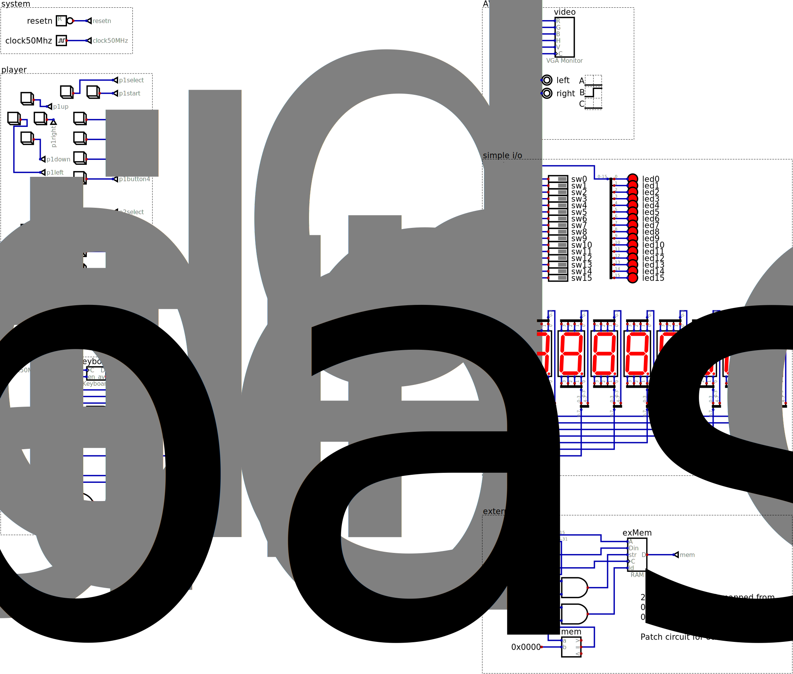

# The shin_jamma interface for FPGA projects

Porting a Verilog project that is working on a specific FPGA board to a different
board can be very time consuming. One solution is to define a standard interface
and implement an adaptator component for each board between the user's project and the actual interfaces implemented by that particular board.

This is similar in spirit to the JAMMA (Japanese Arcade Machine Manufacturers Association) standard interface between cabinets and game boards, which is why
Mario Gazziro suggested the name shin (new) JAMMA. The 56 pin JAMMA connector includes power, analog video and speaker signals as well as button interfaces while this standard just has digital signals, but the functionality is very similar.

## Current Boards

## Planned Boards

- Terasic DE0
- Terasic DE0-CV
- Terasic DE0-Lite
- Terasic DE10-Nano
- Terasic DE2-70
- Terasic DE2-115
- SiPeed Tango Nano 20K
- Xess XSA100
- Xilinx ML401

## Simulation Template

A template for developing Shin JAMMA projects using the Digital simulator is provided. It should be copied to
the working directory (it is probably a good idea to change the name) and the user project should be
inserted. Any unneeded inputs can be simply ignored while any unused outputs should be connected to 0. All
remaining connections should go to the user project.

Some limitations:

- Keyboard: key down events are not generated
- External Memory: only 256KB are provided, but it is easy to change this
- Video: since the simulation is not real time, the number of frames per second will be off. The horizontal and vertical synchronization signals must correspond exactly to a known VESA graphics mode or an error will be indicated
- Sound: since the simulation is not real time, an attempt to show the waveform is done in place to playing the sound
- File System: not implemented yet
