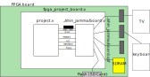

# SHIN_JAMMA FPGA board interface standard version 1

## Files

An FPGA based board named "board" will have a file named **board.json** which
includes all the information needed by the Shin JAMMA web page to generate a
file like **fpga_project_board.v** as well as any project and constraint files (like **project_board.qsf** in this example).

The generated file will include copies of adaptor block modules as needed defined in
the same place as the json file.

The the top module in the selected user project file (**project.v** in this example)
must include some of the following pins with the indicated names (those ending in
_i are inputs of module project while those ending in _o are outputs)

## System Pins

clock50MHz_i, resetn_i

## AV Pins

left_o[15:0], right_o[15:0], audioclk_o

green_o[9:0], red_o[9:0], vsync_o, hsync_o, blue_o[9:0], pixelclk_o

## Player Pins

p1select_i, p1start_i, p1up_i, p1down_i, p1left_i, p1right_i, p1button1_i, p1button2_i, p1button3_i, p1button4_i

p2select_i, p2start_i, p2up_i, p2down_i, p2left_i, p2right_i, p2button1_i, p2button2_i, p2button3_i, p2button4_i

For mouse or trackball up, down, left and right become Ydir, Yclk, Xdir and Xclk respectively.

## Keyboard Pins

strobe_i, key_d_i[7:0]

The strobe signal goes high to indicate an updated value on key_d and remains
high for at least 8 cycles of the 50MHz clock. key_d[7] is low to indicate a
key press and high for a key release, while key_d[6:0] is either the lower case
ASCII character associated with the key or a special code.

## Simple I/O Pins

switch_i[15:0], led_o[15:0], seg_o[63:0]

Up to eight 7 segment displays are supported, which are actually 8 segments
when the dot is included. The segment number plus 8 times the digit number
is the bit to be illuminated.

## External Memory Pins

mem_read_o, mem_write_o, mem_rdy_i, mem_addr_o[31:0], mem_d_o[31:0], mem_d_i[31:0]

Up to 16GB of external memory may be mapped to this interface. Any writes to
unmapped addresses are discarded while any reads from such regions return zero.

SDRAM controllers, specially for recent DDR variations, can be very complex and
even include whole microcontrollers. They might take up more FPGA resources than
the user's project.

## File System Pins

file_read_o, file_write_o, file_cmd_o, file_d_o[7:0], file_d_i[7:0]

When file_cmd is high data is written to the command register or read from
the status register. That signal is low for normal data transfers.

Bits 7:4 of the command register indicate the selected command to be executed
while bits 3:0 select between up to 16 different files.

| 7:4 | command | data | operation |
|-----|---------|---------|-----------|
| 0 | NOP | | does nothing, but will cancel any command in progress |
| 1 | OPEN | string0 | will open the named file |
| 2 | CLOSE | | closes the selected file |
| 3 | READ | | returns the next byte from the file |
| 4 | WRITE | byte | writes the byte at the next position in the file |
| 5 | SEEK | 4 bytes | positions the file at the indicated little endian number |

The READ and WRITE commands remain executing until another command is given.

Bit 7 of the status register is high if the last command caused an error.

Bit 6 of the status register is high if there is a command in progress.

Bits 5:0 indicate which error happened or how many bytes are available for
reading or how much space is available for writing. The maximum number of 63
means "63 or more".

This high level interface is not too different from what some late 1970s
microcomputers (like the Atari 800 or the Commodore Pet) did. This does require
considerable FPGA resources to implement compared to a simple SD Card interface.
By default this interface simply returns an error for all commands.

File names are always the whole path with "/" as subdirectory separators. In
the case of subdirectories they can be passed with either a trailing slash or
not. Without it, the returned bytes are the raw contents of the directory but
with the trailing slash the full names of the files it contains are returned,
one per line. So the empty string is the raw root directory while "/" is
the list of names in the root with any subdirectories showing a trailing slash
to indicate this information.

