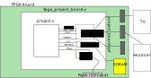

# SHIN_JAMMA FPGA board interface standard version 1

## Files

An FPGA based board named "board" will have three files associated with it:

- board.v: implements the actual adaptor component
- board.md: documents the different options available
- board.ucf, board.xdc, board.qsf: constraint file defining which FPGA pins are connected to which parts of the board

## System Pins

clock50MHz_o, resetn_o

## AV Pins

left_i[15:0], right_i[15:0], audioclk_i

green_i[9:0], red_i[9:0], vsync_i, hsync_i, blue_i[9:0], pixelclk_i

## Player Pins

p1select_o, p1start_o, p1up_o, p1down_o, p1left_o, p1right_o, p1button1_o, p1button2_o, p1button3_o, p1button4_o

p2select_o, p2start_o, p2up_o, p2down_o, p2left_o, p2right_o, p2button1_o, p2button2_o, p2button3_o, p2button4_o

For mouse or trackball up, down, left and right become Ydir, Yclk, Xdir and Xclk respectively.

## Keyboard Pins

strobe_o, key_d_o[7:0]

## Simple I/O Pins

switch_o[15:0], led_i[15:0], seg_i[63:0]

## External Memory Pins

mem_read_i, mem_write_i, mem_rdy_o, mem_addr_i[31:0], mem_d_i[31:0], mem_d_o[31:0]

## File System Pins

file_read_i, file_write_i, file_cmd_i, file_d_i[7:0], file_d_o[7:0]